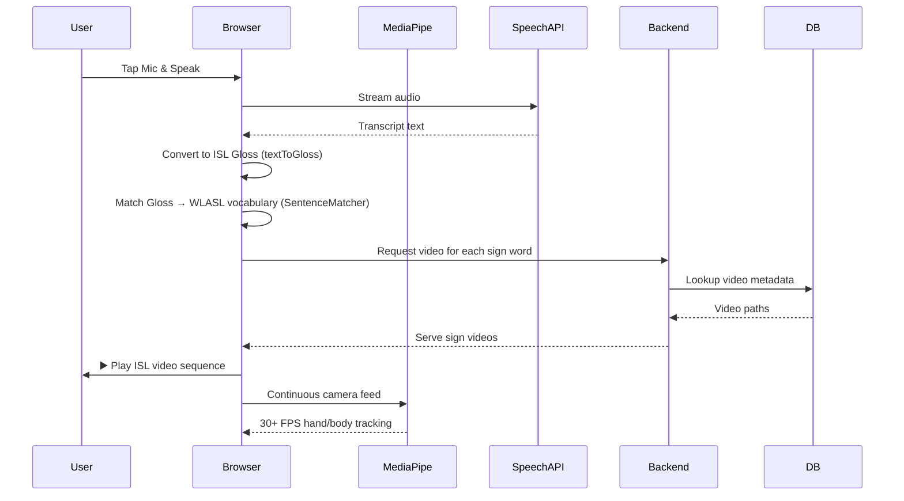

<div align="center">


<br/>

[](https://react.dev/)
[](https://www.typescriptlang.org/)
[](https://nodejs.org/)
[](https://www.fastify.io/)
[](https://www.postgresql.org/)
[](https://www.docker.com/)
[](https://tailwindcss.com/)
[](https://www.prisma.io/)

<br/>

> 🤟 **An AI-powered, full-stack platform converting live English speech into Indian Sign Language (ISL) — making classrooms inclusive, one gesture at a time.**

<br/>

</div>

---

## 📖 Overview

The **Indian Sign Language Educational Platform** bridges the communication gap for the Deaf and Hard-of-Hearing community by translating spoken English directly into ISL video sequences in real time.

It is built as a **monorepo** with two integrated modules:

| Module | Folder | Description |
|--------|--------|-------------|
| 🖥️ **Web Platform** | `web platform/` | Full-featured ISL learning web application with real-time interpreter |
| 🎙️ **Real-Time Interpreter** | `Real time interpreter/` | Standalone, high-performance interpreter module with Fastify backend |

---

## ✨ Key Features

- 🎙️ **Live Speech → ISL Translation** — Tap to speak, and watch your words transform into native sign language video sequences with sub-second latency
- 👁️ **Browser-Based Computer Vision** — Google MediaPipe runs directly in the browser for real-time camera and motion tracking at **30+ FPS**
- 📚 **2,000+ WLASL Sign Vocabulary** — Powered by the Word-Level ASL (WLASL) dataset with an in-memory vocabulary of over **1,500+ native signs**
- ⚡ **High-Performance Backend** — Built on Fastify for ultra-fast API response times, dramatically reducing payload overhead
- 🐳 **Containerized Database** — One-command PostgreSQL setup via Docker Compose for instant local development
- 📱 **Fully Responsive UI** — Mobile-first design powered by TailwindCSS v4

---

## 🏗️ Architecture

```
📦 Indian-Sign-Language-Educational-Platform
│
├── 🖥️ web platform/                    # Indian-SIgn-Language
│   ├── frontend/                        # React + TypeScript + TailwindCSS v3
│   │   └── src/
│   │       ├── app/                    # App router & layout
│   │       ├── modules/                # Feature modules (realtime, learning)
│   │       ├── ui/                     # Shared UI components (Sidebar, BottomNav)
│   │       └── shared/                 # Speech hooks, text-to-gloss utils
│   └── backend/                        # Fastify API + Prisma ORM
│       └── src/
│           ├── app.ts                  # Entry point
│           └── videoMapping.ts         # WLASL sign → video URL map
│
└── 🎙️ Real time interpreter/           # isl module 1
    ├── frontend/                        # React + TypeScript + TailwindCSS v4
    │   └── src/
    │       ├── modules/                # Interpreter video module
    │       │   └── interpreter-video/  # SentenceMatcher, SpeechInput, VideoSequence
    │       └── shared/                 # textToGloss, speech recognition hooks
    └── backend/
        ├── src/server.ts               # Fastify server (video streaming)
        └── prisma/                     # DB schema migrations
```

---

## 🔄 How It Works



---

## 🚀 Getting Started

### Prerequisites

- **Node.js** `>=18`
- **Docker Desktop** (for PostgreSQL)
- **Git**

---

### 🖥️ Web Platform Setup

```bash
# 1. Navigate to the web platform
cd "web platform"

# 2. Install dependencies
npm install

# 3. Start the backend
cd backend && npm run dev

# 4. In a new terminal, start the frontend
cd frontend && npm run dev
```

---

### 🎙️ Real-Time Interpreter Setup

```bash
# 1. Navigate to the module
cd "Real time interpreter"

# 2. Start the PostgreSQL database
docker-compose up -d

# 3. Install dependencies
npm install

# 4. Run Prisma migrations
npx prisma migrate dev

# 5. Start the backend server
npm run dev

# 6. In a new terminal, start the frontend
cd frontend && npm run dev
```

---

## 🛠️ Tech Stack

| Layer | Technology |
|-------|-----------|
| **Frontend Framework** | React 18/19, TypeScript, Vite |
| **Styling** | TailwindCSS v3 & v4, PostCSS |
| **State Management** | Zustand |
| **Routing** | React Router DOM v6/v7 |
| **Computer Vision (CV)** | Google MediaPipe (Holistic, Camera Utils, Drawing Utils) |
| **Speech Recognition** | Native Web Speech API |
| **Backend Framework** | Fastify (Node.js) |
| **ORM** | Prisma |
| **Database** | PostgreSQL 15 |
| **Containerization** | Docker Compose |
| **Language** | TypeScript (Full-Stack) |

---

## 📊 Dataset

This project is powered by the **[WLASL (Word-Level American Sign Language) Dataset](https://github.com/dxli94/WLASL)**, one of the largest publicly available video-based sign language datasets:

- 📹 **2,000+ sign glosses** with corresponding video clips
- 🧠 In-memory vocabulary lookup for ultra-fast sign matching
- 🔍 Exact gloss matching with ISL Gloss normalization pipeline

---

## 📂 Project Highlights

| Metric | Value |
|--------|-------|
| Sign Vocabulary | **2,000+ WLASL signs** |
| Camera Tracking | **30+ FPS** via MediaPipe |
| API Latency | **Sub-second** rendering |
| Deployment | Docker Compose containerized |
| Environment Consistency | **95%+** across setups |

---

## 🤝 Contributing

Contributions are welcome! If you'd like to improve the platform:

1. Fork the repository
2. Create your feature branch: `git checkout -b feature/amazing-feature`
3. Commit your changes: `git commit -m 'Add amazing feature'`
4. Push to the branch: `git push origin feature/amazing-feature`
5. Open a Pull Request

---

## 📄 License

This project is for educational purposes. The WLASL dataset is used under its respective academic license.

---

<div align="center">

Made with 🤟 for inclusive education — *because everyone deserves to be heard and understood.*

⭐ **Star this repo if you found it helpful!**

</div>
